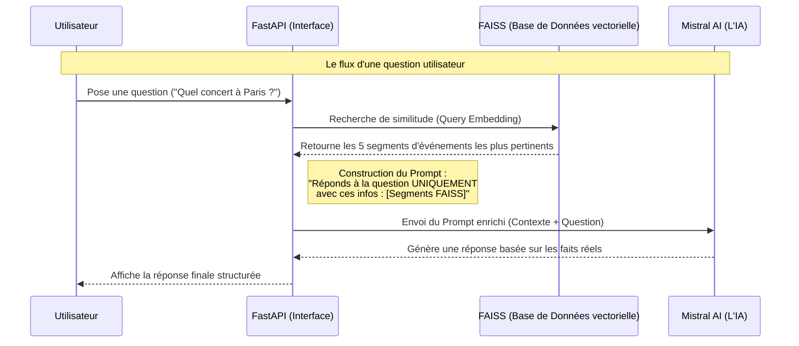
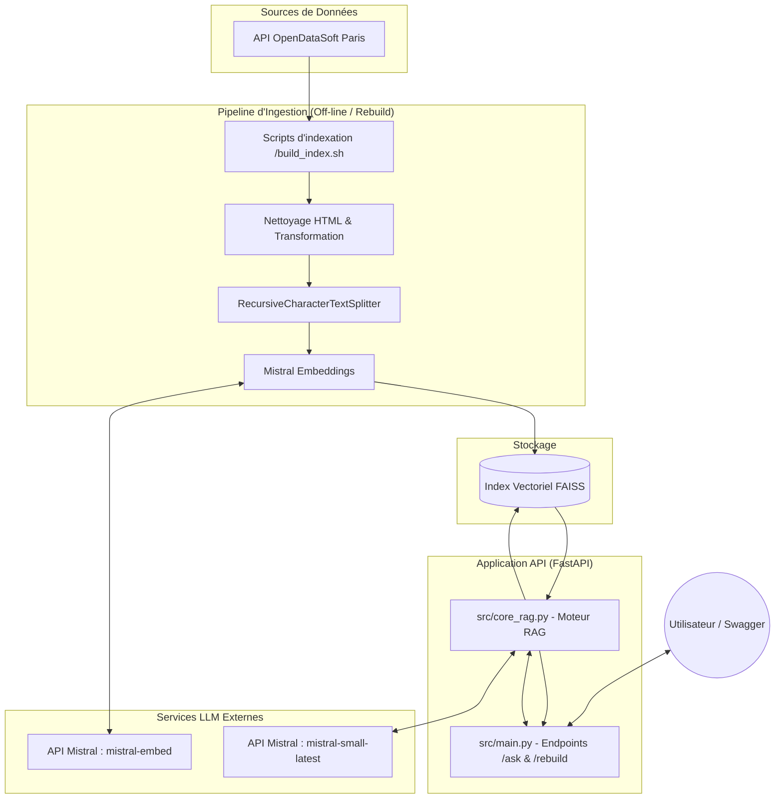

# Projet RAG - API Culture Paris

Ce dépôt contient un système RAG (Retrieval‑Augmented Generation) permettant de interroger des événements culturels parisiens via une API FastAPI.
[Mon dépôt GitHub](https://github.com/AIEngOc2025/Projet7.git)

## Prérequis 

1. Python 3.11+ et un environnement virtuel (`.venv`).
2. Clé MISTRAL_API_KEY définie dans `.env` pour l'usage des modèles Mistral.
3. Docker (Desktop recommandé) si vous souhaitez construire/exécuter le conteneur.

Installez les dépendances :

```bash
python -m venv .venv
source .venv/bin/activate
pip install -r requirements.txt
```

## Construction de l'index vectoriel 

Un script est fourni pour récupérer les données OpenData et créer l'index FAISS dans `data/vdb_paris` :

```bash
./build_index.sh 
```

ou

```bash
python utilitaires/recuperer_chunking_indexer.py
```

Vous pouvez également re-indexer depuis l'API en appelant l'endpoint `/rebuild` une fois l'application démarrée.

## Lancer l'API REST

### En local (sans Docker)

```bash
uvicorn src.main:app --reload --host 127.0.0.1 --port 8000
```

L'interface Swagger est disponible sur [http://127.0.0.1:8000/docs](http://127.0.0.1:8000/docs).

### Avec Docker

```bash
# reconstruire l'image depuis la racine du projet
# lancer le conteneur principal, exposer le port 8000
# (remplacer par 127.0.0.1:8000:8000 si vous ne souhaitez pas
# écouter sur toutes les interfaces)
docker run --rm -p 8000:8000 rag-api
```

> **Remarque** : si Docker signale une erreur `docker-credential-xxx` lors du build, installez Docker Desktop
> ou supprimez/modifiez la clef `credsStore` dans `~/.docker/config.json` en gardant le champ valeur vide `""` ou en lui affectant une autre valeur.

Des images additionnelles sont fournies ; pour les lister :

```bash
docker images | grep rag
```

Par exemple, vous pouvez exécuter l'image `rag-api` ou `rag-paris-app` de cette façon :

```bash
docker run --rm \
  -p 8000:8000 \
  --env-file .env \
  --name rag-api-instance \
  rag-api:latest \
  uvicorn src.main:app --host 0.0.0.0 --port 8000

# ou

docker run --rm -p 9000:8000 rag-paris-app:latest ... changement de port 
```

En cas de conflit de port, arrêtez le conteneur en cours (`docker ps` puis
`docker stop <id>`) ou changez simplement le mappage de ports.

## Tests 

La suite de tests pytest vérifie les composants clés :

```bash
pytest
```

Les scripts pour tester  l'API ou le RAG se trouvent dans le dossier tests/

## Démo & utilisation ( diagramme des séquences )

1. Construire l'index : `./build_index.sh`.
2. Démarrer l'API.
3. Poser des questions via `/ask` ou l'UI Swagger, par ex. :
   - "Quels événements jazz à Paris cette semaine ?"
   - "Y a-t-il des concerts gratuits à la Villette ?"


## Architecture détaillée

Le système repose sur une chaîne moderne en quatre étapes :


1. **Ingestion** : récupération en temps réel des données via l'API OpenDataSoft (ensemble OpenAgenda pour Paris 2025‑2026).
2. **Transformation** : nettoyage HTML et découpage en chunks (~800 caractères) avec `RecursiveCharacterTextSplitter` afin d'améliorer la granularité.
3. **Stockage vectoriel** : création d'embeddings à l'aide du modèle `mistral-embed` et sauvegarde dans un index FAISS local.
4. **Inférence** : recherche sémantique des 5 documents les plus pertinents puis génération de la réponse structurée avec `Mistral-Small-Latest` en imposant des règles de format et de priorité au contexte.

Cette approche assure une **anti‑hallucination** (seul le contexte indexé est utilisé) et une **conscience temporelle** via l'injection de la date actuelle dans le system prompt.

## Évaluation et tests

- Le dossier `tests/` contient des tests unitaires et d'intégration assurant le bon fonctionnement du moteur et de l'API.
- Un script `tests/evaluate_rag.py` propose des scénarios manuels pour explorer les comportements (hors contexte, filtre temporel, requêtes bruitées, etc.).
- Un workflow GitHub Actions (`.github/workflows/ci.yml`) est fourni pour automatiser l'installation, le lancement des tests et la construction Docker à chaque push.

## Flux de travail et démonstration

1. **Initialisation** : construire l'index avec `./build_index.sh`.
2. **Lancement** : démarrer l'API soit localement (`uvicorn`), soit via Docker (`docker run`).
3. **Interrogation** : utiliser l'endpoint `/ask` (ou l'interface Swagger) pour poser des questions en français sur les événements parisiens.

> Exemple de question : « Quels sont les détails de l'événement sur la cartographie des startups en IA prévu en mars 2026 ? »

## Structure des fichiers et scripts

- `src/core_rag.py` : moteur RAG (nettoyage, indexation, prompt, génération).
- `src/main.py` : serveur FastAPI avec endpoints `/ask` et `/rebuild`.
- `utilitaires/recuperer_indexer.py` : script de prétraitement et vectorisation.
- `utilitaires/recuperer_chunking_indexer.py` : script de prétraitement, dindexation et de vectorisation.
- `build_index.sh` : wrapper pour lancer le script d'indexation.
- `Dockerfile` : recette de conteneurisation de l'application.
- `requirements.txt` : dépendances Python.

## Remarques techniques

- La base vectorielle est enregistrée dans `data/vdb_paris`; elle peut être reconstruite via l'API ou le script.
- L'approche multithread n'est pas nécessaire pour l'instant; l'indexation est déclenchée en tâche de fond via FastAPI.
- Les clés sensibles (MISTRAL_API_KEY) sont gérées via `.env` et exclues du dépôt.
